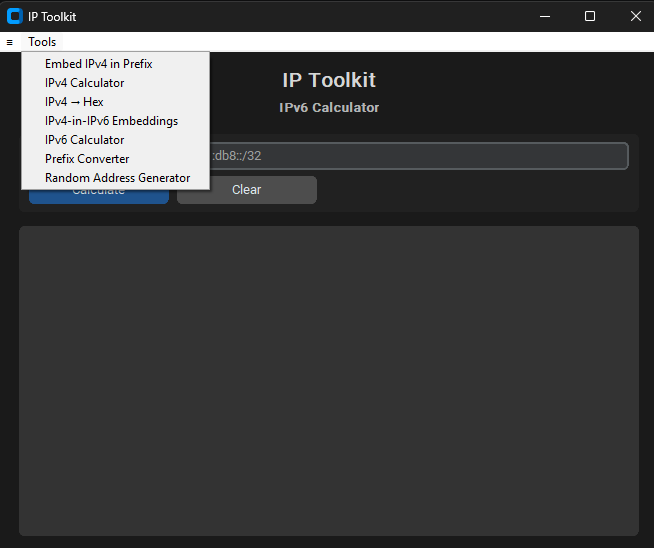

# IP Toolkit

A dark-themed desktop app bundling seven small **IPv6 / IPv4 networking tools** into
one window — subnet math, random address generation, conversions, and IPv4-in-IPv6
embeddings. Built to be *useful and educational*: results come with plain-English
notes and the relevant RFC references.

> Built with Python + [CustomTkinter](https://github.com/TomSchimansky/CustomTkinter).
> All address math uses the Python standard library (`ipaddress`) — no heavyweight
> dependencies.



## Features

Pick a tool from the **Tools** menu; each swaps the input row and shares one output box.

| Tool | What it does |
|------|--------------|
| **IPv6 Calculator** | Network address, first/last address, prefix length, total count, compressed + exploded forms. |
| **IPv4 Calculator** | Network ID, broadcast, netmask, wildcard, usable hosts, host range (handles `/31` and `/32`). |
| **Prefix Converter** | Prefix length ↔ address count / hex netmask / `/64` subnet count, and compressed ↔ exploded address forms. |
| **Random Address Generator** | Random address within your prefix, or from documentation (`2001:db8::/32`) or ULA (`fd00::/8`) space. Blank prefix → global unicast (`2000::/4`). |
| **IPv4 → Hex** | An IPv4 address as colon-hex (`c0:a8:01:01`), packed hex, `0x` form, and decimal. |
| **IPv4-in-IPv6 Embeddings** | How an IPv4 address is embedded in IPv6: **NAT64** (current) and IPv4-mapped, plus the deprecated 6to4 / IPv4-compatible forms — with an explanation that this isn't a real "conversion." |
| **Embed IPv4 in Prefix** | Place an IPv4 into an IPv6 prefix's low 32 bits, shown in hex and dotted-IPv4 forms, with a live documentation-range example. |

### Design highlights
- **Guard rail — never enumerates.** IPv6 networks can hold quintillions of addresses,
  so the app only *indexes* (`net[0]`, `net[-1]`, a random index) and reads
  `net.num_addresses`. It never builds an address list, so it can't hang or exhaust memory.
- **Dark mode** throughout.
- **No pop-ups** — the `≡` menu (About / Python Libraries / GitHub / RFC References)
  prints into the shared output box.
- **Teaches as it works** — e.g. the ULA generator explains why only `fd00::/8` is usable.

## Requirements

- **Python 3.9+**
- **CustomTkinter** (installed via `requirements.txt`; everything else — `ipaddress`,
  `random`, `tkinter` — ships with Python)

## Installation & Usage

```bash
# 1. Clone
git clone https://github.com/confignomad/ipv6-toolkit.git
cd ipv6-toolkit

# 2. (Recommended) create a virtual environment
python -m venv .venv
# Windows:
.venv\Scripts\activate
# macOS/Linux:
source .venv/bin/activate

# 3. Install the dependency
pip install -r requirements.txt

# 4. Run
python ip-toolkit.py
```

## Tips
- Every input field supports **Cut / Copy / Paste / Select All** via right-click (and
  the usual Ctrl+X/C/V, Ctrl+A).
- Use the **documentation** generator (`2001:db8::/32`, RFC 3849) for examples,
  screenshots, and teaching — those addresses are reserved and never routed.

## Standards referenced
RFC 8200 (IPv6), 4291 (addressing), 5952 (text representation), 4193 (ULA),
3849 (documentation), 6052 (NAT64), 3056 (6to4), 7526 (6to4 deprecation),
4632 (CIDR).

## Author
Developed and designed by **Ron Staples**.

## License
No license is set yet. Until one is added, all rights are reserved — if you'd like
others to reuse it, consider adding an [MIT](https://choosealicense.com/licenses/mit/)
or similar license.
